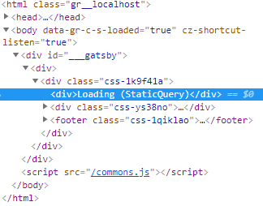

A few days ago Gatsby announced the beta release of V2. Along with it came some exciting changes, the most notable ones being the upgrading of some of the main dependencies (React, Babel, and Webpack) to their latest release, and the introduction of StaticQuery. Oh also, I would be remiss not to mention the "hotter hot reloading"—it is FAST. But hey, that's not all there is to it. Read the official [blog post](https://www.gatsbyjs.org/blog/2018-06-16-announcing-gatsby-v2-beta-launch/) to learn more.

#### Should you migrate?

Well, it depends! None of the changes implemented are significant enough to elicit _immediate_ action in my opinion, especially considering V2 is still in beta, so keep in mind there are bound to be some bumps along the way. If you have a few hours to spend to make sure everything works out smoothly, by all means, go for it! I'm not trying to convince or dissuade you from updating to V2, I'm just trying to help those that run into the same problems I did while updating!

#### _First things first_

Assuming you decide to migrate, my first tip would be to of course checkout a new branch on your repo to work on the changes. This will help keep the workflow a little more organized and make it easier to switch back to V1 if you happen to run into any big obstacles. Once you're ready, open up the official guide for [migrating from v1 to v2](https://next.gatsbyjs.org/docs/migrating-from-v1-to-v2/) and get started!

> _This site has been fully migrated to V2. Feel free to use the [source code](https://github.com/ylorenzana/blog) as reference._

### These are the problems I encountered:

#### Manually updating `package.json` and installing peer dependencies

This was perhaps the most tedious part of the entire process. Finding out which plugins have been upgraded to run on V2 was long and slow for me, but that's because I hadn't found out about [this issue](https://github.com/gatsbyjs/gatsby/issues/5598) that has a list of all the example Gatsby sites that have already been upgraded to V2, so I had to basically change most of the plugins' versions individually to check if the build would break or not. Lucky for you, you don't have to go through the same trouble! I use a fair amount of plugins in my blog, so here's my `package.json` (I removed some irrelevant parts of the file). You can use it as a reference when upgrading your site, and if you're using a plugin that I'm not, refer back to the [GitHub issue](https://github.com/gatsbyjs/gatsby/issues/5598).

```json
{
  "name": "yanglorenzana-blog",
  "description": "The dev blog of Yang Lorenzana",
  "version": "1.0.0",
  "author": "Yang Lorenzana",
  "dependencies": {
    "@fortawesome/fontawesome": "^1.1.5",
    "@fortawesome/fontawesome-free-brands": "^5.0.10",
    "@fortawesome/fontawesome-free-solid": "^5.0.10",
    "@fortawesome/react-fontawesome": "0.0.18",
    "emotion": "^9.1.2",
    "emotion-server": "^9.1.2",
    "facepaint": "^1.2.1",
    "gatsby": "next",
    "gatsby-link": "next",
    "gatsby-plugin-emotion": "next",
    "gatsby-plugin-favicon": "^2.1.1",
    "gatsby-plugin-google-analytics": "next",
    "gatsby-plugin-google-fonts": "0.0.4",
    "gatsby-plugin-manifest": "next",
    "gatsby-plugin-offline": "next",
    "gatsby-plugin-preact": "next",
    "gatsby-plugin-react-helmet": "next",
    "gatsby-plugin-sharp": "next",
    "gatsby-remark-copy-linked-files": "next",
    "gatsby-remark-images": "next",
    "gatsby-remark-prismjs": "next",
    "gatsby-remark-responsive-iframe": "next",
    "gatsby-remark-smartypants": "next",
    "gatsby-source-filesystem": "next",
    "gatsby-transformer-remark": "next",
    "gatsby-transformer-sharp": "next",
    "lodash": "^4.15.0",
    "normalize.css": "^8.0.0",
    "prismjs": "^1.15.0",
    "react": "^16.4.1",
    "react-dom": "^16.4.1",
    "react-emotion": "^9.1.2",
    "react-helmet": "^5.2.0"
  },
  "devDependencies": {
    "gh-pages": "^0.12.0",
    "prettier": "^1.6.1"
  },
  "keywords": ["gatsby"],
  "license": "MIT"
}
```

Incidentally, updating my npm packages unearthed some _unrelated (?)_ problems with npm. After I had all my versions sorted out in my package.json, clearing my `node_modules` directory and resetting the cache did the trick for me.

```bash
rm -rf ./node_modules
npm cache clean --force
npm install
```

#### Using StaticQuery

With the introduction of StaticQuery, you can
now retrieve data directly in your non-page components using GraphQL, so you no longer have to pass data down through props from a layout page to a component. I actually wasn't using this prior to V2 (_technically_ I'm still not). I looked into it when I realized the avatar in my header was a big bottleneck in my page load, which was around the time that V2 was announced. I decided to use gatsby-image along with plugin-gatsby-image-sharp to load in the image in my `Header.js` component using the new StaticQuery API. Unfortunately, StaticQuery has been somewhat buggy as of the release and it wasn't working properly in my build, but apparently they are working on a refactor that should make it much more reliable! Here's a screenshot of what was being rendered on my blog when using StaticQuery:



Refer to the [docs](https://next.gatsbyjs.org/docs/static-query/) if you'd like to give StaticQuery a try. This official [blog post](https://www.gatsbyjs.org/blog/2018-06-08-life-after-layouts/) elaborates on the changes to the Gatsby layout components, which relates to the introduction of the StaticQuery API, so give it a read as well if you want to learn more!

#### Webpack config

Prior to V2, I used the default webpack config that ships with the Gatsby starters. The V2 build seems to have removed the rule for loading in .pdf files from the config. The re-addition of support for these files is being worked on, chances are by the time you're reading this the default config has already been set to support them! Otherwise, here's the small change I added to my `gatsby-node.js` file to add support, in case you also use .pdf files in your site:

```js
exports.onCreateWebpackConfig = ({ actions }) => {
  actions.setWebpackConfig({
    module: {
      rules: [
        {
          test: /\.pdf$/,
          use: 'url-loader',
        },
      ],
    },
  });
};
```

## That's a wrap!

Those were pretty much the only problems I ran into when transitioning. The process was somewhat frustrating and tedious for me, but that doesn't mean it has to be for you, especially because most of my problems were related to npm and were for the most part unrelated to V2. If you happen to run into the same or similar problems I did, hopefully, this blog post will help you overcome them! If you find yourself stuck or discover a bug, open a new issue in the official [Gatsby repo](https://github.com/gatsbyjs/gatsby/issues), the contributors are very kind and helpful!
