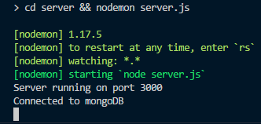
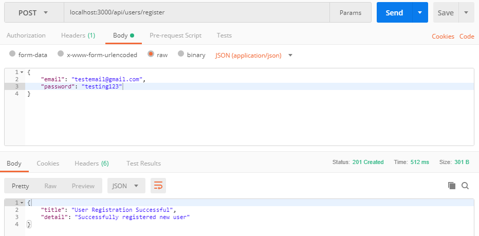
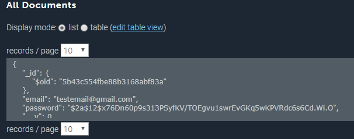

**Another tutorial series for API authentication** in Node.js? Yep! But in this case, we won't be using [JSON Web Tokens](https://jwt.io/) (aka JWTs) like pretty much every other tutorial out there, because [reasons](https://hn.algolia.com/?query=author:tptacek%20jwt&sort=byPopularity&prefix&page=0&dateRange=all&type=comment)! I won't try to convince you that JWTs are bad, nor will I tell you not to use them, we just won't be using them for this project. Instead of stateless authentication with JWTs, we will roll out our own implementation of server-side sessions using bearer tokens to represent them. Wait, does that mean our API won't be RESTful? Well, yes, but for good reason. According to security expert [Thomas Ptacek](https://news.ycombinator.com/item?id=16157002): "You almost certainly do not and will not need _stateless_ authentication; to get it, you will sacrifice security and some usability, and in a typical application that depends on a database to get anything done anyways, you'll make those sacrifices for nothing". Whew! I'm glad I got that out of the way. Moving on!

**TL;DR** If you are not interested in going through the how's and why's and would just like to see the end result, you can view the source [here](https://github.com/ylorenzana/node-express-api-auth).

> _**Before we begin:** This tutorial is aimed towards intermediate developers and assumes prior knowledge and experience working with Node.js and a basic understanding of authentication mechanisms. If at any point you get stuck, lost, or confused by my instructions, you can open a [new issue](https://github.com/ylorenzana/node-express-api-auth/issues/new) on the GitHub repo for this project, or contact me directly on [Twitter](https://twitter.com/yanglorenzana). I'll be more than happy to help you out._

##Overview of What We Will Build Throughout the Tutorial Series
We will be building an API using [Express.js](https://expressjs.com/) and [mongoose](http://mongoosejs.com/) with as most basic a setup as we can come up with to handle user authentication (registration/login). We will showcase the authentication by implementing some protected and public routes. We are keeping the API as basic as possible because it is meant to be used as a starting point for bigger projects.

A high-level explanation of the auth system goes like this:

1.  A user logs in with credentials (email and password combination)
2.  Server verifies credentials. If valid, the server initiates a session on the database. Sessions include the userId (from database) of the respective user
3.  When the session is initialized, a token to represent the authenticated session is generated. This token is generated by _hexifying_ 16 random bytes generated using [Node.js's crypto module](https://nodejs.org/api/crypto.html#crypto_crypto_randombytes_size_callback). This token is set as a cookie in the server's response
4.  Client receives server's response. The session cookie is then sent along with every request from the client. For client to access protected routes, the client's requests must include a valid session cookie. Server uses middleware to validate token

**In This Tutorial (Part 1)**: We will cover user registration and login. This includes the setup of our Node.js server, the creation of the User model for our database, and the routes to handle registration and login.

**In Part 2**: We will cover sessions. This includes the creation of the Session model for our database, the token generation to represent sessions, changes to our users route to use the sessions, and implement new protected routes to showcase single sign on.

After we cover the main parts of the project throughout the series, we will be implementing additional features, such as CSRF mitigation and password reset. We're sticking to the basic authentication, for now, so let's get started!

##First Things First!

> _**Pre-reqs**: You will need to have [Node.js](https://nodejs.org/en/), [mongoDB](https://www.mongodb.com/) (or a mongo deployment with a service like [mLab](https://mlab.com/home)), and [Postman](https://www.getpostman.com/) installed to follow along._

Let's get our project setup. Open up your terminal and make a new directory for the project and let's set it up:

```bash
  mkdir nodejs-api-auth && cd nodejs-api-auth
  npm init
  npm i express body-parser cookie-parser mongoose mongoose-unique-validator bcryptjs
  npm i --save-dev nodemon
```

I tried to keep the amount of 3rd party libraries used to a minimum. Don't worry if you're not familiar with some of these libraries, I'll explain what's necessary as we start using them. You can, of course, also use yarn if you'd prefer.

Open up your `package.json` file and change the value for `"main"` to point to `server.js` and create a new `"start"` script to run our server using nodemon:

```json
"name": "node-auth-boilerplate",
"version": "1.0.0",
"description": "Boilerplate for very basic node + express.js user registration/authentication.",
"main": "server.js",
"scripts": {
  "start": "cd server && nodemon server.js"
}
```

##Let's Create Our `Server.js` File
Now we're getting into the fun stuff! Let's start off by getting the boilerplate code for our server file out of the way. Create a new directory for our server files and the new `server.js` file where our base node application will live.

```bash
mkdir server && cd server
touch server.js
```

Great! Time for the boilerplate code. Open up `server.js` that we just created. We will import and use some of the libraries we installed earlier, create a connection to mongoDB, and start our server that will be set up using express.js. Note that you need to create a mongoDB database for our server to connect to.

Let's add this to our `server.js` file:

```js
const express = require('express');
const bodyParser = require('body-parser');
const cookieParser = require('cookie-parser');
const mongoose = require('mongoose');

mongoose.Promise = global.Promise;
mongoose
  .connect(
    'YOUR MONGODB URI HERE',
    { useNewUrlParser: true
  )
  .then(
    () => {
      console.log('Connected to mongoDB');
    },
    (err) => console.log('Error connecting to mongoDB', err)
  );

const app = express();
const port = process.env.PORT || 3000;

//sets up the middleware for parsing the bodies and cookies off of the requests
app.use(bodyParser.json());
app.use(cookieParser());

app.listen(port, () => {
  console.log(`Server running on port ${port}`);
});

module.exports = { app };
```

That's a good start. We still don't have any routes setup, we will handle that in just a bit.

Notice how we are specifying the URI for our mongoDB directly in the `server.js` file? Let's refactor that into a new `secrets.js` file, in case you want to push your project up to a public repo. This way you can just add it to your `.gitignore` and keep those secrets safe! **Don't forget** to actually add your mongoDB URI in there.

Create a new file `secrets.js`:

```js
const secrets = {
  dbUri: process.env.DB_URI || 'YOUR MONGODB URI GOES HERE',
};

const getSecret = (key) => secrets[key];

module.exports = { getSecret };
```

Now we can change the code over in `server.js` to import and use our `secrets.js` module

```js
const { getSecret } = require('./secrets');

mongoose
  .connect(
    getSecret('dbUri'),
    { useNewUrlParser: true
  )
  .then(
    () => {
      console.log('Connected to mongoDB');
    },
    (err) => console.log('Error connecting to mongoDB', err)
  );
```

Run `bash›npm start` to verify everything is running correctly.



Working properly? Great!

##Creating Our Mongoose Models
Let's start working on our database schemas using [mongoose](http://mongoosejs.com/). Mongoose provides an easy solution to model our app's data. We will create models for our Users and Sessions, these models will shape the documents in the collections of our database. Let's create a new directory for our models and create two files, one for each model.

```bash
mkdir models
touch models/user.js models/session.js
```

We'll start off with our `user.js` model by adding the keys for email and password (the keys will be the fields for the collection). We are actually going to leave our `session.js` file blank for this part of the tutorial, we will work on that on [part 2](/#).

We **_do not_** want to store our users' passwords in our database in plaintext so we will be salting and hashing them before saving each document. To do this, we will write a function using the [`bcrypt.js`](https://www.npmjs.com/package/bcryptjs) library we installed earlier. `Bcrypt.js`'s API exposes some neat methods for generating a secure salt and hash based on the Blowfish cipher. If you want to change the number of rounds (aka cost factor) used to generate the salt, make sure
you use **_at least 12_**.

This is what our `user.js` file will look like:

```js
const mongoose = require('mongoose');
const uniqueValidator = require('mongoose-unique-validator');
const bcrypt = require('bcryptjs');

const UserSchema = new mongoose.Schema({
  email: {
    type: String,
    required: true,
    minlength: 1,
    trim: true, //calls .trim() on the value to get rid of whitespace
    unique: true, //note that the unique option is not a validator; we use mongoose-unique-validator to enforce it
  },
  password: {
    type: String,
    required: true,
    minlength: 8,
  },
});

//this enforces emails to be unique!
UserSchema.plugin(uniqueValidator);

//this function will be called before a document is saved
UserSchema.pre('save', function(next) {
  let user = this;

  if (!user.isModified('password')) {
    return next();
  }

  //we generate the salt using 12 rounds and then use that salt with the received password string to generate our hash
  bcrypt
    .genSalt(12)
    .then((salt) => {
      return bcrypt.hash(user.password, salt);
    })
    .then((hash) => {
      user.password = hash;
      next();
    })
    .catch((err) => next(err));
});

module.exports = mongoose.model('User', UserSchema);
```

Our user model is ready, we can now work on creating our first routes!

##Creating User Routes
Let's add a little more to our project structure. Create a new directory and file for our user routes.

```bash
mkdir routes && touch routes/users.js
```

We'll begin by creating the `api/users/register` and `api/users/login` routes. These routes will handle user registration and login.

###Register Route

Let's bring in express to create our router, bcrypt for password validation, and the User model we created earlier.

Our `api/users/register` route expects email/password credentials from the client, this is where `body-parser` that we set up in our `server.js` file comes in, we will be destructuring the email and password values out of the request's body. Because this is user provided input, we want to validate it to make sure it's the right type of data—if we didn't validate it, we could run the risk of malicious users injecting code into our application.

> _Note that we are hashing the passwords server-side. This means passwords are being sent in plaintext in the requests. Because of this, your app **MUST** use https in production._

####Validating The Request's Body
Let's create a simple utility function to assert the received email is a valid email address. We will use [this](http://emailregex.com/) regular expression to test it. If we received the wrong type of data, the server will respond with an error. Otherwise, if everything checks out, we can continue and create our new user.

####Saving The User Document
Once we verified we have the right data, we can use the `user.js` model as a constructor to create our new user. Remember about the `'pre'` save hook we wrote in our `user.js` model? It's being called before we save our new user and handling the password salting and hashing, so now we don't have to do it explicitly in our register route.

Once the user is persisted, the server will respond with a success message and a status code **201** confirming a new resource was created!

Let's translate all of this into our `routes/users.js` file:

```js
const express = require('express');
const bcrypt = require('bcryptjs');

const User = require('../models/user');

const router = express.Router();

//util function to check if a string is a valid email address
const isEmail = (email) => {
  if (typeof email !== 'string') {
    return false;
  }
  const emailRegex = /(?:[a-z0-9!#$%&'*+/=?^_`{|}~-]+(?:\.[a-z0-9!#$%&'*+/=?^_`{|}~-]+)*|"(?:[\x01-\x08\x0b\x0c\x0e-\x1f\x21\x23-\x5b\x5d-\x7f]|\\[\x01-\x09\x0b\x0c\x0e-\x7f])*")@(?:(?:[a-z0-9](?:[a-z0-9-]*[a-z0-9])?\.)+[a-z0-9](?:[a-z0-9-]*[a-z0-9])?|\[(?:(?:25[0-5]|2[0-4][0-9]|[01]?[0-9][0-9]?)\.){3}(?:25[0-5]|2[0-4][0-9]|[01]?[0-9][0-9]?|[a-z0-9-]*[a-z0-9]:(?:[\x01-\x08\x0b\x0c\x0e-\x1f\x21-\x5a\x53-\x7f]|\\[\x01-\x09\x0b\x0c\x0e-\x7f])+)\])/;

  return emailRegex.test(email);
};

router.post('/register', async (req, res) => {
  try {
    const { email, password } = req.body;
    if (!isEmail(email)) {
      throw new Error('Email must be a valid email address.');
    }
    if (typeof password !== 'string') {
      throw new Error('Password must be a string.');
    }
    const user = new User({ email, password });
    const persistedUser = await user.save();

    res.status(201).json({
      title: 'User Registration Successful',
      detail: 'Successfully registered new user',
    });
  } catch (err) {
    res.status(400).json({
      errors: [
        {
          title: 'Registration Error',
          detail: 'Something went wrong during registration process.',
          errorMessage: err.message,
        },
      ],
    });
  }
});
```

Awesome! Let's move on to the login route. Don't worry, we will be testing these really soon!

###Login Route

Our login route will share similar logic to our register route. We will retrieve the user's credentials from the request's body, and validate it. Our error handling might look a little bit different, but that's because our `catch (err){}` in this block will default to responding with a **401** status code (unauthorized) to indicate the credentials were not authorized. So when we receive wrong data from the user, we will respond with a **400** status code (bad request) to inform the user the request won't be processed.

####Querying For User
Once the retrieved data was validated, we can query our database to check if the received email exists. If the email is not registered, we'll `throw new Error()`.

Once we retrieve a user with the request's email from our database, we have to compare the password we received in the request to the stored hash of the user document. We will use `bcrypt.js`'s compare method (the asynchronous version) to do just that! If the password matches the hash, it will resolve with a promise, otherwise, it will throw an error.

Once the credentials have been validated, the server will respond with a successful login message!

Append this to our `routes/users.js` file:

```js
router.post('/login', async (req, res) => {
  try {
    const { email, password } = req.body;
    if (!isEmail(email)) {
      return res.status(400).json({
        errors: [
          {
            title: 'Bad Request',
            detail: 'Email must be a valid email address',
          },
        ],
      });
    }
    if (typeof password !== 'string') {
      return res.status(400).json({
        errors: [
          {
            title: 'Bad Request',
            detail: 'Password must be a string',
          },
        ],
      });
    }
    //queries database to find a user with the received email
    const user = await User.findOne({ email });
    if (!user) {
      throw new Error();
    }

    //using bcrypt to compare passwords
    const passwordValidated = await bcrypt.compare(password, user.password);
    if (!passwordValidated) {
      throw new Error();
    }

    res.json({
      title: 'Login Successful',
      detail: 'Successfully validated user credentials',
    });
  } catch (err) {
    res.status(401).json({
      errors: [
        {
          title: 'Invalid Credentials',
          detail: 'Check email and password combination',
          errorMessage: err.message,
        },
      ],
    });
  }
});

module.exports = router;
```

Almost there! Now we just have to actually tell our Node app to use the routes we just created. Notice that we are now exporting the router in the last line.

####Using The Users Routes

Let's add two more lines of code to our `server.js` file so we can use the users routes.

In `server.js`:

```js
//other imports
const usersRoute = require('./routes/users');

//other app.use statements
app.use('/api/users', usersRoute);
```

That's all it takes! Our API now has working endpoints to handle user registration and login!

##Testing Routes With Postman

Time to finally bring out Postman and test our routes!

Load up Postman, and let's send some requests to our server. Let's test the `api/users/register` route. Enter `localhost:3000/api/users/login` as the request URL, set the request to POST, and add the credentials for our new user in the request's body as Content-Type: application/json.



The server responded with a success message. **It works**!

Let's verify our user was _actually_ stored in our database. In my case, I used mLab to host my mongoDB instance. You should see the user you just created in the user's collection like so:



There's our user! With a hash as the value for password, no plaintext, just as we planned. You can now test the `api/users/login` route using those same credentials. All you have to do is change the request url in postman to match that endpoint and you're set!

Now that we tested it with correct inputs, make sure to also test for edge cases, like using an invalid email, no inputs at all, or even try noSQL injection! I won't be walking you through it because this tutorial is already very long, and I think you'll be able to handle that part on your own.

##Wrap Up

Whew! We got a lot done in this tutorial. We got out Node server set up, created a model for our Users, and added routes to handle user registration and login. In [part 2](), we will implement single sign-on using server sessions and more! Follow me on Twitter to know as soon as part 2 is published, I'm working on it now and it should be out really soon!
