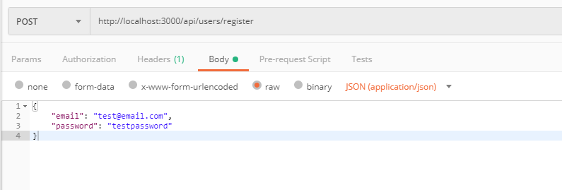
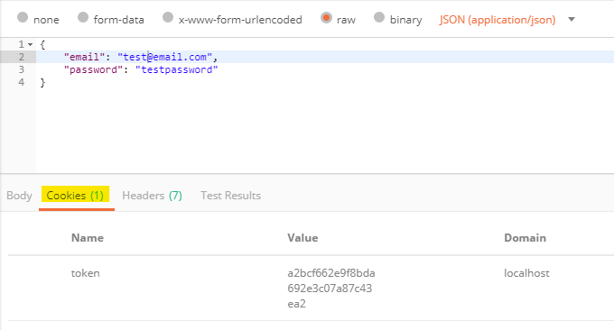
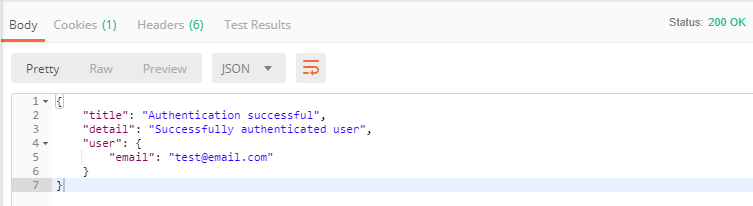

We're back with the Node.js authentication tutorial! In [part 1](/nodejs-api-authentication-tutorial-pt-1), I gave a high-level explanation of how our authentication would work, we created a model for how our users will be stored in MongoDB, and we wrote the endpoints to handle user registration and login. In this part of the tutorial, we will cover sign-on sessions/tokens and protected routes. With that being said, let's pick back up right where we left off!

> _This is part 2 of a tutorial series. Read [part 1](nodejs-api-authentication-tutorial-pt-1) or view the [source](https://github.com/ylorenzana/node-express-api-auth) of this project to catch up!_

## Overview of Sessions and Token Logic

As explained in part 1 of this tutorial, we are going to be implementing (stateful) sign-on sessions for our user authentication. In a nutshell, a session will be initialized in our server and stored in our database every time a user logs in with valid credentials. Each session will have a token generated to identify it and will be stored alongside the user's `userId`. This token will be included in the server's response cookie for the client to include in every subsequent request. All the routes in our API that require authentication (protected routes) will check the request for a valid session token.

## Creating the Session Mongoose Model

We're going to start by creating the model for our sessions (we created the blank file for our session model in part 1). To begin, we'll import the necessary packages into our module. Our model will have the following keys: a token to identify the session, a timestamp for when the session is initialized, the `userId` of the user that signed in (this would be the equivalent of a foreign key in a relational database), and the status of the session which can be set to either valid or expired.

Let's open up `models/session.js` and translate all of this into code:

```js
const mongoose = require('mongoose');
const uniqueValidator = require('mongoose-unique-validator');
const crypto = require('crypto');

const SessionSchema = new mongoose.Schema({
  token: {
    type: String,
    required: true,
  },
  createdAt: {
    type: Date,
    default: Date.now,
  },
  userId: {
    type: mongoose.Schema.Types.ObjectId,
    required: true,
  },
  status: {
    type: String,
    enum: ['valid', 'expired'],
    default: 'valid',
  },
});
```

Pretty straightforward. Now let's figure out how we will generate the tokens that will identify the sessions!

### Generating Tokens to Identify User Sessions

We need to generate a unique token for every session. This is the token that will be sent as a cookie on each request and identify the session in our database, and in turn, identify the user as well. We're going to keep it simple and use _hexified_ 16+ random bytes generated with Node.js's [crypto module](https://nodejs.org/api/crypto.html#crypto_crypto_randombytes_size_callback) as our tokens. This is very easy to implement and it does not require us to to make any security sacrifices or compromises, so it's a win-win! Let's create a new static method in our `session.js` module using the `randomBytes()` method from the crypto API, we'll name it `generateToken()`. We're going to promisify the call to `randomBytes()` so we can use async/await when using our `generateToken()` method.

In our `session.js` file:

```js
SessionSchema.statics.generateToken = function() {
  return new Promise((resolve, reject) => {
    crypto.randomBytes(16, (err, buf) => {
      if (err) {
        reject(err);
      }
      const token = buf.toString('hex');
      resolve(token);
    });
  });
};
```

While we're at it, let's create an instance method to expire sessions. All the method has to do is set its status to expired using mongoose's update API. Because this is an instance method (the method is going to be invoked from a specific session instance), we don't need the ID of the session we want to expire. That should be all we need for our session model, so let's add it to our `module.exports` at the end.

Append our new function to `session.js`:

```js
SessionSchema.methods.expireToken = function() {
  const session = this;
  return session.update({ $set: { status: 'expired' } });
};

module.exports = mongoose.model('Session', SessionSchema);
```

Awesome! We just finished the logic for our sessions and tokens. All we have to do now is use it in our API! Let's make some changes to the login/register routes we created in part 1.

## Implementing Sign-On Sessions In Our Routes

We're going to be creating a new session in our database after every successful user login and/or registration. We will be using the methods we wrote in our `session.js` module to create a unique token per session. Once we initialize a new session, we'll set a new cookie with our new session token on the server to be passed along in future requests. Sending the token per se won't accomplish anything—we are going to create new middleware to check that the client has sent a valid token in the request, and we'll then use this middleware in every protected endpoint/route (protected endpoints are ones that require the user to be authenticated in order to access). Let's get to it!

### Updating Our `api/users/login` and `api/users/register` Route Handlers

We'll start by changing the logic in our `users.js` route a tad. Begin with importing our new `session.js` module at the top of the file (along with the other imports). Let's then create a **new function** for initializing a new session— we'll use this function on successful logins in the register and login routes. First, we'll generate a token using the static method we created earlier, `Session.generateToken()`. We'll then use the token returned from the function along with the `userId` that just logged in to create a new session and save it to our database.

Let's write this up at the top of our `routes/users.js`, after our imports:

```js
const Session = require('../models/session');

const initSession = async (userId) => {
  const token = await Session.generateToken();
  const session = new Session({ token, userId });
  await session.save();
  return session;
};
```

Awesome! Now we have our function to initialize a session, so we'll add calls to the function after every successful user login/registration. Now we have to **set a cookie** with the token of the session that was just created (cookies are just key-value pairs sent as headers of the request/response). Express.js makes it very simple to set a new cookie in our response, all we have to do is use `res.cookie` like so:

```js
res.cookie('nameForCookie', cookieValue, { options });
```

In our project, we'll call our cookie `'token'`. Here's a list of the flags/options we will be using for our token cookie:

- **httpOnly**: Makes our cookie only accesible by the server (AKA cookie can't be accessed using JavaScript on the client, XSS mitigation)
- **sameSite**: Prevents browser from sending cookie along with cross-site requests (CSRF mitigation, but we'll cover CSRF in more detail in part 3)
- **maxAge**: Option for expiring the cookie after a given amount of time (relative to current time)
- **secure**: Sets cookie to be used only with HTTPS (**set this to true** in production)

Refer to the [Express.js docs](https://expressjs.com/en/4x/api.html#res.cookie) for the complete list of cookie flags/options.

In our `api/users/register` route:

```js
router.post('/register', async (req, res) => {
  try {
    const { email, password } = req.body;
    if (!isEmail(email)) {
      throw new Error('Email must be a valid email address.');
    }
    if (typeof password !== 'string') {
      throw new Error('Password must be a string.');
    }
    const user = new User({ email, password });
    const persistedUser = await user.save();

    // we'll use the ID of the new user for our new session
    const userId = persistedUser._id;
    const session = await initSession(userId);

    res
      .cookie('token', session.token, {
        httpOnly: true,
        sameSite: true,
        maxAge: 1209600000, // 2 weeks
        secure: process.env.NODE_ENV === 'production', // will only be set to true in production
      })
      .status(201)
      .json({
        title: 'User Registration Successful',
        detail: 'Successfully registered new user',
      });
  } catch (err) {
    //error handling here
  }
```

And in our `api/users/login` route:

```js
router.post('/login', async (req, res) => {
  try {
    const { email, password } = req.body;
    if (!isEmail(email)) {
      return res.status(400).json({
        errors: [
          {
            title: 'Bad Request',
            detail: 'Email must be a valid email address',
          },
        ],
      });
    }
    if (typeof password !== 'string') {
      return res.status(400).json({
        errors: [
          {
            title: 'Bad Request',
            detail: 'Password must be a string',
          },
        ],
      });
    }
    const user = await User.findOne({ email });
    if (!user) {
      throw new Error();
    }
    // use the ID of the user who logged in for the session
    const userId = user._id;

    const passwordValidated = await bcrypt.compare(password, user.password);
    if (!passwordValidated) {
      throw new Error();
    }
    // initialize our session
    const session = await initSession(userId);

    // same options as before!
    res
      .cookie('token', session.token, {
        httpOnly: true,
        sameSite: true,
        maxAge: 1209600000,
        secure: process.env.NODE_ENV === 'production',
      })
      .json({
        title: 'Login Successful',
        detail: 'Successfully validated user credentials',
      });
  } catch (err) {
    // error handling here
  }
```

There it is! We just finished one of the bigger parts of our project! Now let's actually write the logic that leverages these sessions for authentication requests!

## Writing Our Middleware and Protected Routes

We'll write a [middleware](https://expressjs.com/en/guide/writing-middleware.html) function that will be in charge of verifying that the request the server received was made by an authenticated user. The function will be called before an endpoint is hit and decide whether to continue the request-response cycle or reject the request—depending on whether an authenticated user made the request.
Let's start by creating a new folder in the root of our directory for our middleware, we'll call it `middleware`:

```bash
mkdir middleware && touch middleware/authenticate.js
```

Because we set up the logic in the register and login routes to create a session (linked to the user) and set the session's token in a cookie, all our middleware needs to do is check that the request we received included a valid session token in the cookie. To do this, we will use the `session.js` model to query our database for the session token received with a status of `'valid'`.
Let open up the `authenticate.js` file we just created and translate this into code:

```js
const Session = require('../models/session');

const authenticate = async (req, res, next) => {
  try {
    // get the session token from the request cookies
    const { token } = req.cookies;
    if (!token || typeof token !== 'string') {
      // if the token is not a string, we know the session token was not set by the server and is therefore invalid
      throw new Error('Request cookie is invalid.');
    }
    // query the database using the session token and checking for status of valid
    const session = await Session.findOne({ token, status: 'valid' });
    if (!session) {
      // if the a session is not found with the provided token, clear the cookie
      // e.g. user session expired on server, but the browser still has the cookie
      res.clearCookie('token');
      throw new Error('Your session has expired. You need to log in.');
    }
    // set the session retrieved from db on the request object
    // the request object will be passed on to the next() call
    req.session = session;

    // continues the request-response cycle
    next();
  } catch (err) {
    res.status(401).json({
      errors: [
        {
          title: 'Unauthorized',
          detail: 'Authentication credentials invalid',
          errorMessage: err.message,
        },
      ],
    });
  }
};

module.exports = { authenticate };
```

That's all we need to check if the request was made by an authenticated user! Now let's create some new protected endpoints in our API to showcase our sessions.

### Writing the GET `users/me` route

The whole point of adding sessions to our API was to authenticate users without having them provide us with an email/password combination every time they request protected data.
To showcase our sessions, we'll create the GET `users/me` route. This route will be used to retrieve data about the logged-in user. We'll keep it simple for this project since we're not storing much data on our user table (collection in MongoDB terms), but in a more realistic scenario, you could use this route to retrieve user data that builds up the UI for a user profile. Let's get to it!

We are going to add the `authenticate()` middleware we just added to our project to this new endpoint, which means we need to import it in our `routes/users.js` module. In a nutshell, the `authenticate()` function is going to be invoked with the same `req` object the server received before the endpoint handler is called—hence why these functions are known as middleware. Remember we set up the middleware to add the session to the request object on successful user login/registration? This request object is passed into the `next()` callback, in this case the GET `users/me` handler. All this means is we now have access to the `userId` in the `request.session` object, which we can use to query the user table(collection) to retrieve the available user data. Let's translate all of this into code:

In our `routes/users.js` file:

```js
// import our authenticate middleware
const { authenticate } = require('../middleware/authenticate');

// note how we now pass in the authenticate function as an argument
// to the router.get() call
router.get('/me', authenticate, async (req, res) => {
  try {
    // using object destructuring to grab the userId from the request session
    const { userId } = req.session;

    // only retrieve the authenticated user's email
    const user = await User.findById({ _id: userId }, { email: 1, _id: 0 });

    res.json({
      title: 'Authentication successful',
      detail: 'Successfully authenticated user',
      user,
    });
  } catch (err) {
    res.status(401).json({
      errors: [
        {
          title: 'Unauthorized',
          detail: 'Not authorized to access this route',
          errorMessage: err.message,
        },
      ],
    });
  }
});
```

Now that we have added our new endpoint, all that's left to do is test our implementation!

## Testing Our Changes

It's time to verify that all the logic we just added to our API is behaving as expected. Let's test our updates using [Postman](https://www.getpostman.com/) as we did in part 1.

To begin, let's boot up our server by running `npm start` on the root directory of our project. Once the server is up on port 3000 and is connected to MongoDB, we want to register a new account with our API. Open up Postman and enter the API url for the register endpoint into the url bar. Next, we want to build up our request body using dummy data, make sure to change the format of the body to raw JSON(application/json). This is what my request looks like in Postman:



Once your request is ready, send it to the server to register your account. Once the request is fulfilled, notice the cookie in the cookies tab of the response pane:



If you are seeing the token/value pair in the response, it means our sessions are being created as expected—you can also verify the session was stored in your mongoDB database sessions table.

Now that we know the sessions are correctly being initialized on the server and set on the cookie, let's test our new `users/me` endpoint. Change the url on Postman to GET: `http://localhost:3000/api/users/me` and hit send. This is what the response should look like, depending on what email you used to register your account with:



That's all there is to it! We were able to retrieve the logged-in user's email by providing the session token cookie. If you would like to see how the GET `users/me` endpoint behaves when you're not logged in, delete the cookie from the request in the 'Manage Cookies' window in postman and send the request. You can also test that sessions are being properly initialized in the POST `users/login` route by using an existing account!

## Wrap up

We successfully implemented sessions on our server and were able to create a protected endpoint which only authenticated users can access. You can reuse the `authentication` middleware function to make other routes protected, just like we did in this tutorial. With that, the main user authentication functionality has been implemented in our API. What else will you be building for your API? What other features would you like to be added to the project? Let me know on [Twitter](https://twitter.com/yanglorenzana)!
